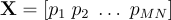

# Face recognition using OpenCV and CUDA

<p align="center">
  
</p>

Face recognition is an artificial intelligence technique used to identify or verify the identity of a subject from one or more images portraying it.  
In this project, we implement, in CUDA, one of the many face recognition techniques proposed throughout the literature. The choice has fallen on the so-called Eigenfaces approach which is based on the Principal Component Analysis. It has been chosen due to its simplicity and because its basic components are common to other methods so that the present
project can be easily generalized towards, for example, techniques as Fisherfaces or Laplacianfaces.  
The basic components of Eigenfaces are available in CUDA-accelerated libraries. In this project, we will learn the basic aspects of the OpenCV library which makes several facilities available for image manipulation and processing, as well as providing interfacing with parallel programming in CUDA. Moreover, we will get acquainted with cuSOLVER, another library of the CUDA toolkit, which is a collection of functions performing matrix factorizations or computing the solution of linear systems based on least square or eigenvalue approaches. In particular, we will familiarize ourselves with the parallel calculation of the Singular Value Decomposition (SVD) of a matrix.  
The developed approach will be applied to the face recognition problem using a customized database of face images. For the sake of simplicity, here we will be ignoring the often employed face detection pre-step, by “manually” isolating the image regions containing the relevant faces.  
In this project, we will be covering the following topics:

  - Face recognition approaches
  - Face recognition by the Eigenface approach
  - Using OpenCV with CUDA support
  - Principal Component Analysis (PCA)
  - Singular Value Decomposition (SVD) using the cuSOLVER library
  - Implementation of Eigenface approach

Having an understanding of OpenCV with CUDA support will put you in a position to benefit from significant accelerations in computer vision and image processing codes.  
Getting familiar with the cuSOLVER library will enable access to a wide range of routines of interest for linear algebra problems.

## Getting Started

In this project, the key elements of the Eigenfaces approach will be provided on a detailed level and the exploited OpenCV and cuSOLVER libraries will be briefly recalled. As prerequisites, fundamental knowledge of linear algebra and of the SVD of a matrix is required. Knowledge of other kinds of matrix transformations (such as bidiagonalization) will be useful for a better understanding of the internal operation of the algorithms.  
For a mild introduction to the problem and to the required technicalities, it is a good idea to examine the most relevant face recognition techniques and the rationales behind them.

## Face recognition approaches

Recognizing the face of people from a database of static images enables unprecedented applications. More and more companies employ facial recognition technologies to unlock devices (such as smartphones) or to access restricted areas, like banks or airports. Furthermore, Google already runs searches of specific human pictures and Facebook already
implements face recognition codes in its social forum.  
Often, face recognition focuses on the face only in order to work properly, while ignoring everything (typically background objects) that is not a face. For this reason, its usage is often integrated with face detection codes which isolate that part of the image that lies with the face and which improves the face recognition performance. The following figure illustrates face detection in an image:

<p align="center">
  
  <br>
     <em>Figure 1. Face detection.</em>
</p>

Moreover, face recognition codes must be capable of performing the recognition even if the image subject’s face is rotated, shadowed or is in any way not in frontal view. The sophisticated processing codes recently developed are able to be significantly robust against such non-idealities.  
A very large number of face recognition codes have been developed throughout the literature. Among them, Eigenfaces , Fisherfaces  or Laplacianfaces  approaches are very popular. They are based on the possibility to reduce the dimensionality of a  image from  to  by using second-order global (Eigenfaces and Fisherfaces) or local (Laplacianfaces) statistics.  
More specifically, the Eigenfaces technique uses Principal Component Analysis (PCA). PCA computes the eigendecomposition, meaning it calculates the eigenvalues and eigenvectors of the covariance matrix of the training data. The eigenfaces are the eigenvectors of such an eigendecomposition and the relevant subspace is that associated with the largest eigenvalues of the covariance matrix. In this way, most of the data variance is catched and unnecessary correlations among the original features of the training set are eliminated.  
In some cases, instead of noticing the most variance, it is preferable to find a subspace for properly mapping the faces of the training set. In particular, faces belonging to the same class are mapped in the same direction. Furthermore, training faces belonging to different classes are kept as far apart from each other as possible. In these cases,
Discriminant Analysis (DA) is of interest.  
The most popular DA is the Linear Discriminant Analysis (LDA) which is due to R.A. Fisher, the father of modern statistics, in 1936. When the subspace representation of a set of face images is determined by LDA, the basis vectors are called Fisherfaces. It has been observed that the Fisherfaces method has lower error rates than the Eigenface one.  
Eigenfaces and Fisherfaces use second-order statistics. However, versions thereof exist that are extensions to higher-order statistics.
They are the so-called Kernel methods and, in particular, the Kernel Eigenfaces and Kernel Fisherfaces methods, respectively.  
Different from the “global” behavior of Eigenfaces and Fisherfaces, Laplacianfaces use Locality Preserving Projection (LPP) to capture the local intrinsic geometry and structure of the data. Laplacianfaces are so-called since they are the optimal linear approximations to the eigenfunctions of the Laplace-Beltrami operator on the face manifold.  
Other methods involve the use of *Gabor* wavelets in which the features of the test images are extracted by the homonymous wavelets, the employment of hidden Markov models, or the adoption of Active Appearance Models (AAM).  
Of course, each of the above-mentioned methods presents its own strengths and weaknesses and often different methods are combined to improve the quality of the results. Nonetheless, from the implementation point of view, some of them, such as Eigenfaces, Fisherfaces, and Laplacianfaces, share common parallel programming tools and strategies.  
For this reason, in this project, we will favor theoretical simplicity at the expense of performance and will consider the Eigenfaces cases. Nevertheless, this approach will enable us to eviscerate a whole series of CUDA programming techniques that could be used either to implement other face recognition codes or to set up methods of a different
nature.  
In order to illustrate the programming tools that will be used in the present project, in the next section, the usage of OpenCV with CUDA support will be briefly described with the aid of simple codes.

## Integrating OpenCV with CUDA

In this section, we will first briefly introduce OpenCV along with its data types. Then, we will move towards its CUDA-based acceleration, discussing some relevant device memory storage issues. Finally, we will present two simple examples of OpenCV processing accelerated by CUDA.  

### What is OpenCV?

OpenCV (Open Source Computer Vision Library) is an open-source library for computer vision, written in C++, whose most common applications concern the following:
  
  - image processing (for example, filtering, interpolation, red-eye removal in photos),
  - real-time video streaming (for example, intrusion detection in video surveillance),
  - eye tracking,
  - model extraction of a 3D object,
  - machine learning in connection to problems of face detection,
  - face reconstruction,
  - object recognition,
  - augmented reality.

During the years, OpenCV has become very popular among researchers and developers. This is due to the availability of a large number of highly optimized Codes for image processing showing an excellent trade-off between accuracy and speed, and due to the support for different, everyday use platforms such as Windows, Linux, Android, iOS and MacOS.
Moreover, OpenCV makes available wrappers for different commonly employed programming languages, such as Python, Java, and Matlab.  
Since 2011, OpenCV routines accelerated by CUDA are at disposal. CUDA accelerated OpenCV routines are based on hand-written kernels or on calls to libraries of the CUDA ecosystem, such as cuBLAS for matrix operations or NVIDIA Performance Primitives (NPP) for video operations, signal processing or image functions. Being OpenCV open-source, the details of the implementations can be inferred directly by combing through the codes.  
In the Appendix, a short guide regarding the installation of OpenCV with CUDA support on Windows machines and a short example in which OpenCV uses the GPU is provided. Unfortunately, none of the face recognition classes are CUDA accelerated. As we are using CUDA accelerated by OpenCV for face recognition, it will require some handcraft.  
In order to get familiar with the use of OpenCV with CUDA, we will present an introductory example, step-by-step, by matching each step to a different Subsection. Before starting the journey, let’s explore OpenCV types.

## OpenCV data types

Primitive types in OpenCV are unsigned `char`, `bool`, `signed char`, `unsigned short`, `signed short`, `int`, `float` and `double`.  
All data types in OpenCV have the following syntax:

``` c++
CV_<bit-depth>{U|S|F}C(<number_of_channels>)
```

From the previous code, `\bigg bit-depth \bigg` is the number of bits used by the data type, `U` stands for `unsigned`, `S` for `signed`, for `float` and `\bigg number_of_channels \bigg` is the number of involved channels. Concerning the latter, the number of channels ranges from `1` to `512` and enables to store, for example, grayscale images ( channel) or color images ( channels).  
The types that we will use for the face recognition problem will be `CV_8UC1`, which will serve to load the grayscale images from the image database, and `CV_32FC1`, which will be the type in which the loaded image will be cast to subsequently perform the processing.  
In the next subsection, the key ingredients of CUDA-accelerated with OpenCV for the development of the Eigenfaces approach will be dealt with. Mastering the programming tools is the first step to being successful. The second key point, namely, theory, will be presented afterward.

### The GpuMat class and its memory storage

In this subsection, we introduce the key aspects of CUDA-accelerated programming with OpenCV which are functional to the face recognition approach to be developed. More in detail, the `cv::cuda::GpuMat` class, which enables the image to be stored on the GPU, will be illustrated.  
In this respect, the attention will be focused on the host-device memory transfers of the related objects and on the access to its individual elements in the light of the typical padding used in the GPU storage for such a class. Two illustrative examples will be provided on the handling of the `cv::cuda::GpuMat` and the tools that will be employed for the
development of the face recognition approach.  
At the end of this subsection, you will have all the programming tools to set up Eigenfaces.

#### The GpuMat class and allocation modality

The class `cv::cuda::GpuMat` is a container class enabling to store images in OpenCV on the GPU. A GPU image of grayscale floating-point pixels ( channel), a typical example of an image that we will use in facial recognition, is defined for example as:

``` c++
cv::cuda::GpuMat d_A(height, width, CV_32FC1);
```

In the previous code, `height` is the number of rows, `width` is the number of columns, and `CV_32FC1`, as mentioned above, is the type. By using the indicated syntax, OpenCV obviously allocates space for a `height x width` matrix in global memory. Nevertheless, it is necessary to spend some words concerning the allocation modality.  
In the previous chapters, we have used “continuous” allocations. In other words, the involved vector or matrix elements occupied consecutive memory locations. The allocation performed by `cv::cuda::GpuMat` is, however, of “non-continuous” kind, also called *pitched*.  
This means that the matrix is stored row-wise, the row elements are stored consecutively, but the address of the first element of a row does not correspond to the address following the last element of the previous row. The pitched allocation modality is illustrated in the figure below:

<p align="center">
  
  <br>
     <em>Figure 2. CUDA pitched memory.</em>
</p>

In other words, between the last element of a row and the first element of a subsequent row some unused padding space is left.  
In order to understand the reasons for this kind of allocation, which provides for the nonfull use of global memory, let us briefly recall the concept of *coalescence*.

#### Memory coalescence and pitched memory

Coalescence of global memory accesses is one of the most important aspects to account for in the optimization of CUDA codes. When the thread of a warp requests the read or write access to global memory elements, the circuitry of the video card arranges for the global memory access to be coalesced into as few transactions as possible.  
Saying it differently, when the threads of a warp require access to global memory elements, groups of contiguous elements, called a *cache line*, are entirely withdrawn. Typically, the transactions are minimized when the addresses to be read or written satisfy some *alignment* requirements.  
To illustrate what above said, but without going into the details, let us assume that a cache line is `128` bytes long. Let us also suppose that each thread of a warp requires access to  bytes of global memory. For example, each thread needs a floating-point number which indeed occupies  bytes.  
If the floating-point numbers requested by all the threads in a warp are spatially adjacent and if the first element to be accessed meets a -bytes alignment, then a single coalesced transaction will be enough to service the memory access at hand. Such coalesced memory access is illustrated in the figure below:

<p align="center">
  
  <br>
     <em>Figure 3. Coalesced memory access.</em>
</p>

Opposite to that, even if the  floating-point numbers to be accessed by the entire warp are spatially adjacent, but the first element to be accessed does not meet the -bytes alignment, then the access to all the  floating-point numbers needed by the entire warp will require two transactions since the elements are distributed on two different cache lines. This is illustrated in the figure below:

<p align="center">
  
  <br>
     <em>Figure 4. Uncoalesced memory access.</em>
</p>


Then, the reason for the use of pitched memory is that of making the memory access more efficient and to improve the performance of CUDA-accelerated OpenCV codes. Of course, the padding illustrated in figure [2](#pitchedMemory) is not always necessary since the number of matrix columns can be such that to already guarantee the cache line alignment. It is nevertheless possible to check the continuity of the allocation by using the method `isContinuous()` which returns `true` if the allocation is non-pitched, `false` otherwise.  
Following this digression, let us familiarize ourselves with the use of CUDA under OpenCV with examples.

## Getting started with OpenCV and CUDA

In this subsection, we present a couple of examples of increasing complexity in which we start becoming familiar with the elements of CUDA-accelerated OpenCV programming. Such elements, when properly combined, will serve to build up the final face recognition approach. Indeed, without proper knowledge of the tools of the trade, it is impossible to fruitfully do a job.  
In the first example, we will linger on the basic questions. In particular, we will take care of allocation, filling, GPU-access, and host-device transfers of host or device OpenCV matrices, specifically under the light of the padding typically used in the GPU storage.  
In the second example, we will highlight the CUDA-accelerated, OpenCV routines for the computation of averages and for the matrix multiplications needed for the calculation of covariance matrices. We will also illustrate the use of the tool, offered by the cuSOLVER library, for the evaluation of the SVD of a matrix. It should be however noticed that the final approach presented at the end of the chapter will not need the explicit computation of covariance matrices.  
Nevertheless, such an operation will be a good excuse for becoming familiar with averages and matrix multiplications, which will be needed in the final code. Let’s move on to the first example.

### The first example using OpenCV and CUDA

The main purpose of the first getting started code is that of illustrating the memory organization for what concerns the container class `cv::cuda::GpuMat` and how it is possible to perform host-to-device and device-to-host transfers using different approaches.

  - To start with, the code stated below creates a `h_A` matrix, of size `2x3`, stored on the host and composed of single-channel `float` elements, just like the matrices that will represent the images of interest in the subsequent face recognition code:
    
    ``` c++
    cv::Mat h_A(2, 3, CV_32FC1);
    ```
    
    Indeed, the container class `cv::Mat` represents the CPU class analogous to `cv::cuda::GpuMat`.  
    The subsequent rows define the values of the matrix elements so that the matrix is:
    
    <p align="center">
           [1]
    </p>
    
  - In particular, the next snippet illustrates (step-by-step), how the `cv::Mat` host matrix `h_A` must be filled to equal the matrix in equation [\[1\]](#matrixFaceRecognition):
    
    ``` c++
    // --- First row
    h_A.at<float>(0, 0) = 3.f;
    h_A.at<float>(0, 1) = 4.f;
    h_A.at<float>(0, 2) = 12.f;
    // --- Second row
    h_A.at<float>(1, 0) = -1.f;
    h_A.at<float>(1, 1) = 0.3f;
    h_A.at<float>(1, 2) = -4.323f;    
    ```
    
    As it can be seen from the above snippet, the elements of `h_A` are accessed and assigned, thanks to the `cv::Mat::at<T>(r, c)` method, where `r` is the element row, `c` is the element column and the template argument depends on the matrix type.

  - Being C++ `ostream` operator `<<` overloaded on the OpenCV `cv::Mat` class, following the definition of the matrix elements, the entire matrix is visualized:
    
    ``` c++
    std::cout << "Matrix = " << std::endl << " " << h_A << std::endl << std::endl;
    ```

  - Moreover, with the aim of showing examples of the use of the method defined in this container class, the overall number of elements is displayed by `h_A.total()`. The code for the same is displayed below:
    
    ``` c++
    printf("\n\nTotal number of elements of A is %d\n", h_A.total());
    ```

  - We need to verify whether the allocation of the elements of `h_A` is continuous by using `h_A.isContinuous()`, shown below:
    
    ``` c++
    printf("Matrix allocation continuous? %d\n", h_A.isContinuous());
    ```
    
    It should be noticed that, typically, the allocation operated in `cv::Mat` is continuous so that `h_A.isContinuous()` will be true in most of the cases, while the allocation operated in `cv::cuda::GpuMat` is, in most of the cases, pitched.

  - Before considering the `cv::cuda::GpuMat` case, it is convenient to familiarize with the use of pointers to access rows or individual elements of `h_A`. The `cv::Mat` class makes the `ptr()` available. It returns a pointer to the first element of the generic row, say `r`, as shown below:
    
    ``` c++
    float *rowPointer = h_A.ptr<float>(r);
    ```

  - In this way, it is possible to access the element of row `r` and column `c` using `rowPointer[c]`, the code is given below:
    
    ``` c++
    printf("\n\nCPU memory organization - version 1\n");
    for (int r = 0; r < h_A.rows; r++) {
        float *rowPointer = h_A.ptr<float>(r);
        for (int c = 0; c < h_A.cols; c++) {
            printf("%f\n", rowPointer[c]); } }
    ```

  - Alternatively, it is possible to use the field data by `h_A.data` and access the elements of `h_A` consecutively, by recalling that the elements of the class `cv::Mat` are ordered row-wise:
    
    ``` c++
    printf("\n\nCPU memory organization - version 2\n");
    float *dataPointer = (float *)h_A.data;
    for (int k = 0; k < h_A.total(); k++) {
        printf("%f\n", dataPointer[k]); }
    ```
    
    Let’s now turn to the CUDA part. 

  - Once defined the matrix `h_A`, it would be necessary to declare a matrix `d_A` of class `cv::cuda::GpuMat` and then perform the data transfer from host to the device. This is possible by exploiting the `upload()` method, shown below:
    
    ``` c++
    cv::cuda::GpuMat d_A;
    d_A.upload(h_A);
    ```

  - Alternatively, it is possible to define the values of `d_A` directly from `h_A` by using the following line:

    ``` c++
    cv::cuda::GpuMat d_A;
    d_A.upload(h_A);
    ```

  - The code then continues by verifying whether the data `d_A` have a pitched allocation or not:
    
    ``` c++
     printf("\n\nGpuMat continuous = %d\n", d_A.isContinuous());
    ```
    
     As mentioned, most likely the allocation will be pitched.

  - Moreover, the code verifies the type of matrix `d_A` by the method `type()` and its dimensions by the fields `rows` and `cols`, shown below:
    
    ``` c++
    std::string ty = cv::typeToString(d_A.type());
    printf("\n\nGpuMat image is %s %dx%d \n", ty.c_str(), d_A.rows, d_A.cols);
    ```
    
    Of course, such information is available also for the `cv::Mat` class.

  - At this point, it is didactically useful to investigate how it is possible to transfer the data stored in `d_A` back to a standard array `h_Atest`, functioned on the CPU, of dimensions `d_A.rows * d_A.cols` and allocated by:
    
    ``` c++
    float *h_Atest = (float *)malloc(d_A.rows * d_A.cols * sizeof(float));    
    ```
    
    Unfortunately, due to the padding in the memory allocation, it is not possible to use `cudaMemcpy` to accomplish such a copy. Indeed, on accounting for the padding, if we would perform a copy of `d_A.rows * d_A.cols * sizeof(float)` bytes, not all the elements of `d_A` would be copied.

  - The function to use for moving pitched memory areas is `cudaMemcpy2D()`, whose syntax is reported below:
    
    ``` c++
    cudaError_t cudaMemcpy2D(void * dst, size_t dpitch, const void * src, size_t spitch, size_t width, size_t height, enum cudaMemcpyKind kind)    
    ```
    
    The arguments of `cudaMemcpy2D()` are given in detail below:
    
      * `dst`: It is the pointer to the destination memory area, namely, for our case, `h_Atest` which points to host-side memory locations.
    
      * `pitch`: It is the pitch of destination memory in bytes. In our particular case, it coincides with the number of matrix columns (either `h_A` or `d_A`) multiplied by the size of a single `float`, i.e. `sizeof(float)`, since we have already checked that the CPU allocation of the matrix at hand is continuous.
    
      * `src`: It is the pointer to the destination memory area which equals `(float *)d_A.data`, for the case of our interest.
    
      * `spitch`: It is the pitch of source memory in bytes. Now, `spitch` does not coincide with `d_A.cols * sizeof(float)`, since we know that the matrix has a pitched GPU allocation and such a value would not take into account the padding of each column. The cumulative information on how many bytes each row comprehensive of the padding occupies can be achieved using the step field of `cv::cuda::GpuMat`, that is, `d_A.step`.
    
      * `width`: It is the dimension, in bytes, of each row obtained by excluding the padding, namely, the number of "interesting" bytes to transfer. The adjective “interesting” indicates that the padding does not contain any information. In our case, width is `d_A.cols * sizeof(float)`, that is, the number of columns by the size of a solitary `float`.
    
      * `height`: It is the number of rows to transfer, `d_A.rows` in our case.
    
      * `cudaMemcpyKind`: It represents the direction of the memory transfer, `cudaMemcpyDeviceToHost` in our case.
    
    In the case of our interest, the relevant resultant call is thus:
    
    ``` c++
    cudaCHECK(cudaMemcpy2D(h_Atest, d_A.cols * sizeof(float), (float *)d_A.data, d_A.step,d_A.cols * sizeof(float), d_A.rows, cudaMemcpyDeviceToHost));
    ```

  - To make a consistency check, the code displays also the result of the memory transfer from device to host carried out by `cudaMemcpy2D()`:
    
    ``` c++
    printf("\n\nUsing cudaMemcpy2D\n");
    for (int k = 0; k < d_A.rows * d_A.cols; k++) { printf("%f\n", h_Atest[k]); }
    ```
    
    The last performed operation is again a printout of the matrix elements, but this time operated by avoiding the device-to-host transfer and by visualizing the elements directly from within a CUDA kernel function.

  - The `printKernel()` kernel function in question is illustrated in Listing [1](#printKernel):
    In the kernel function, the thread of index `(rowIdx, colIdx)` calculates the pointer `rowSrcPtr` to the first element of a row. Such pointer is computed starting from the pointer to the first element of the GPU matrix, namely `srcPtr`. The latter is a `float *`, but is cast to `char *`.  
    The reason for that is easy to say. Indeed, being `srcStep` the length in bytes of each row including the padding and being the size of a char equal to  byte, the offset `rowIdx * srcStep` moves the pointer forward of a number of bytes equal to the number of
    bytes of all the rows preceding that with index `rowIdx`.  
    In this way, the pointer positions itself at the first element of the row with index `rowIdx`. However, in Listing [1](#printKernel), in order to read floating-point
    elements, the `rowSrcPtr` pointer must be cast back to `float *`. After that, the element of row `rowIdx` and of column `colIdx` can
    be accessed as `rowSrcPtr[colIdx]`.
  
    ``` c++
    __global__ void printKernel(const float * __restrict__ srcPtr, const size_t srcStep, const int Nrows, const int Ncols) {
        int rowIdx = blockIdx.y * blockDim.y + threadIdx.y;
        int colIdx = blockIdx.x * blockDim.x + threadIdx.x;
    
        if (rowIdx >= Nrows || colIdx >= Ncols) return;
    
        float *rowSrcPtr = (float *)(((char *)srcPtr) + rowIdx * srcStep);
        printf("%d %d %d %f\n", srcStep, rowIdx, colIdx, rowSrcPtr[colIdx]); }
    ```
<p align="center" id="printKernel" >
     <em>Listing 1. The `printKernel()` kernel function to print the elements of a `cv::cuda::GpuMat` matrix.</em>
</p>

  - Such kernel function is executed by a two-dimensional array of threads, for which the threads along the `x`-direction (`x` threads) scan the matrix column-wise, while the threads along the `y`-direction (`y` threads) scan the matrix row-wise:
    
    ``` c++
    dim3 blockDim(BLOCKSIZE_X, BLOCKSIZE_Y);
    dim3 gridDim(1, 1);
    printKernel<<<gridDim, blockDim>>>((float *)d_A.data, d_A.step, d_A.rows, d_A.cols);
    cudaCHECK(cudaPeekAtLastError());
    cudaCHECK(cudaDeviceSynchronize());    
    ```

  - Finally, let us illustrate also the procedure by which each row is individually transferred and printed out:
    
    ``` c++
    printf("\n\nUsing cudaMemcpy\n");
    for (int r = 0; r < d_A.rows; r++) {
        float *rowPointer = d_A.ptr<float>(r);
        cudaCHECK(cudaMemcpy(h_Atest, rowPointer, d_A.cols * sizeof(float), cudaMemcpyDeviceToHost));
        for (int c = 0; c < d_A.cols; c++) { printf("%f\n", h_Atest[c]); } }
    ```
    
    Please, notice that `d_A.ptr<float>(r)` points to the first element of the row with index `r`.

We are now ready to take some steps towards the tools that we will need to implement the face recognition code with an example slightly more complicated than the previous one.

### The second example using OpenCV and CUDA

The purpose of this second example is to compute the SVD of the covariance matrix between two images. These operations, apart from some minor differences, are those underlying the Eigenfaces face recognition. The code available in GitHub will contain not only the steps below illustrated but also printouts of the intermediate results. For the sake
of brevity, such check-points will be omitted below since we have already shown how to achieve them in the code above.  
Unfortunately, we do not have the possibility of recalling the details of the theory behind SVD, so that we assume the previous knowledge.

  - For the time being, we will not use real images loaded from files, but we will consider two small, `2x3` matrices defined from within the code as done before.  
    The following code shows the initialization of the matrices:
    
    ``` c++
    // --- 2x3 float, one-channel matrix
        cv::Mat h_A1(2, 3, CV_32FC1);
        cv::Mat h_A2(2, 3, CV_32FC1);
        // --- First row
        h_A1.at<float>(0, 0) = 3.f;
        h_A1.at<float>(0, 1) = 4.f;
        h_A1.at<float>(0, 2) = 12.f;
        // --- Second row
        h_A1.at<float>(1, 0) = -1.f;
        h_A1.at<float>(1, 1) = 0.3f;
        h_A1.at<float>(1, 2) = -4.323f;
        // --- First row
        h_A2.at<float>(0, 0) = -1.f;
        h_A2.at<float>(0, 1) = 2.f;
        h_A2.at<float>(0, 2) = 0.34f;
        // --- Second row
        h_A2.at<float>(1, 0) = -2.32f;
        h_A2.at<float>(1, 1) = 37.f;
        h_A2.at<float>(1, 2) = 11.121f;
    ```
    
    These images will play the role of the database images used in our final project for face recognition.

  - After having defined the two matrices `h_A1` and `h_A2` on CPU, the idea is to reshaping them to rows and uploading them as the rows of a GPU matrix, say `d_A`, of dimension `2x6`, in which the rows correspond to the two matrices, while the columns correspond to the matrix elements. This is done with the following Listing
    [2](#H2DCopy):
    
    ``` c++
    // --- Transform matrix A1 into row
        h_A1 = h_A1.reshape(0, 1);
        // --- Transform matrix A2 into row
        h_A2 = h_A2.reshape(0, 1);
        // --- GPU memory allocation
        cv::cuda::GpuMat d_A(2, h_A1.total(), CV_32FC1);
        // --- Copy first row
        float *rowPointer = d_A.ptr<float>(0);
        cudaCHECK(cudaMemcpy2D(rowPointer,d_A.step * sizeof(float),
        h_A1.ptr<float>(0),h_A1.step * sizeof(float),
        h_A1.cols * sizeof(float),1,cudaMemcpyHostToDevice));
        // --- Copy second row
        rowPointer = d_A.ptr<float>(1);
        cudaCHECK(cudaMemcpy2D(rowPointer,d_A.step * sizeof(float),
        h_A2.ptr<float>(0),h_A2.step * sizeof(float),
        h_A2.cols * sizeof(float),1,cudaMemcpyHostToDevice));
    ```
    <p align="center" id="H2DCopy" >
       <em>Listing 2. Host-to-Device matrix copy.</em>
    </p>    
    
    The first part of the snippet regards the reshaping of matrices `h_A1` and `h_A2` in rows. This is obtained by using the `reshape()` method. It should be noticed that the first argument of `reshape()` refers to the new number of channels that the reshaped matrix must-have. A value of `0` implies that the number of channels must
    be unchanged. The second argument is the new number of rows. Of course, the new number of columns is computed accordingly. Once performed the reshape, the two obtained rows should be copied within the rows of matrix `d_A`. This is carried out by transferring the individual rows using `cudaMemcpy2D()` in a similar fashion to the last part of the example code illustrated in the foregoing subsection.

  - Now, in order to compute the covariance matrix of the two images, it is necessary to evaluate the “average” image and then subtract it from the entire database. In other words, each database image must be “shifted” of an amount equal to the average image. From the programming point of view, the “average” image can be calculated as the column-wise mean of matrix `d_A`:
    
    ``` c++
    cv::cuda::GpuMat d_mean(1, h_A1.total(), CV_32FC1);
        cv::cuda::reduce(d_A, d_mean, 0, 1);
    ```
    
    The average vector, which is a `1x6` vector, is hosted by the `d_mean` matrix. The average is essentially a reduction operation since, for what above said, each element of `d_mean` must equal the average of the corresponding column of `d_A`. Moreover, as seen in the foregoing chapter, a reduction is something that can be performed in CUDA in a particularly efficient way. Fortunately, in OpenCV, the function `cv::cuda::reduce` performing the parallel reduction on GPU is available. The first two arguments of such a
    function are the source `d_A` and destination `d_mean` matrices, respectively.  
    The third argument represents the dimension along which performing the reduction. In our case, since we want a reduction along the columns, we use `0` as an argument. Finally, the fourth argument specifies whether a simple summation, an average, a maximum or a minimum is of interest. Since we need an average, the fourth argument is `1`. The average array is finally moved to the host for a check.

  - Once computed the average, we need to subtract it from every single row of `d_A`. This is performed by the following `removeMeanKernel()` kernel function:
    
    ``` c++
    __global__ void removeMeanKernel(const float * __restrict__
            srcPtr, float * __restrict__ dstPtr, const size_t srcStep,
            const size_t dstStep, const int Nrows, const int Ncols) {
        
            int rowIdx = blockIdx.y * blockDim.y + threadIdx.y;
            int colIdx = blockIdx.x * blockDim.x + threadIdx.x;
        
            if (rowIdx >= Nrows || colIdx >= Ncols) return;
        
            const float *rowSrcPtr = (const float *)(((char *)srcPtr) +
                0 * srcStep);
            float *rowDstPtr = ( float *)(((char *)dstPtr) + 
                rowIdx * dstStep);
            rowDstPtr[colIdx] = rowDstPtr[colIdx] - rowSrcPtr[colIdx];}
    ```
    <p align="center" id="printKernel" >
       <em>Listing 3. The `removeMeanKernel()` kernel function to remove the average from each row of `d_A`.</em>
    </p>    
    
  - Such kernel function is very similar to that in Listing [1](#printKernel) and will not be further detailed. It is executed by using the following call:
    
    ``` c++
    dim3 blockDim(BLOCKSIZE_X, BLOCKSIZE_Y);
        dim3 gridDim(1, 1);
        removeMeanKernel << <gridDim, blockDim >> > ((float *)d_mean.data, 
            (float *)d_A.data, d_mean.step, d_A.step, 2, h_A1.total());
        cudaCHECK(cudaPeekAtLastError());
        cudaCHECK(cudaDeviceSynchronize());
    ```
    
    It should be noticed that `d_mean.step` and `d_A.step` are the lengths, in bytes, of the rows of `d_mean` and `d_A` including the padding, the number `2` indicates the number of rows of `d_A` and `h_A1.total()` is its number of rows.  
    Once removed the average from the images, it is time to compute the covariance matrix.

  - The covariance matrix can be computed as a matrix product, i.e., the product between `d_A` and its transpose. Being the covariance matrix symmetrical, it can be equivalently calculated as the transpose of `d_A` and `d_A` itself. Accordingly, a `2x2` matrix `d_Cov` is defined and the `cv::cuda::gemm` routine, available in the CUDA extension of OpenCV, is exploited. The `cv::cuda::gemm` routine uses cuBLAS under the hood and its syntax is reported below:
    
    ``` c++
    cv::cuda::gemm(const GpuMat& src1, const GpuMat& src2, 
            double alpha, const GpuMat& src3, double beta, GpuMat& dst,
            int flags=0, Stream& stream=Stream::Null())
    ```

  - The result of the matrix product is stored in `dst`:
    
    ``` c++
    dst = alpha * op1(src1) * op2(src2) + beta * op3(src3)
    ```
    
    Actually, `cv::cuda::gemm` executes a weighted product, with weight `alpha`, of `src1` and `src2` and afterward performs a weighted sum, with weight `beta`, of the product result and `src3`. Before performing the operations among `src1`, `src2`, and `src3`, the matrices undergo operations denoted by `op1()`, `op2()` and `op3()`, respectively.  
    Such operations are transpose operations and the need to perform them must be expressed by the flags argument. In particular, such an argument should equal the sum `c1 * GEMM_1_T + c2 * GEMM_2_T + c3 * GEMM_3_T` where `c1`, `c2`, and `c3` are `1` or `0` depending on the need, for the corresponding matrix, to perform the transposition or
    not. Finally, the field stream will not be focused being outside the scope of this project.

  - The rows for the computation of the covariance matrix are below:
    
    ``` c++
    const int Nrows = 2;
        const int Ncols = 2;
        cv::cuda::GpuMat d_Cov(Nrows, Ncols, CV_32FC1);
        cv::cuda::gemm(d_A, d_A, 1.f, d_Cov, 0.f, d_Cov, cv::GEMM_2_T); 
    ```
    
    Following the computation of the covariance matrix, we now turn to compute its Singular Value Decomposition (SVD).  
    As one might have noticed, in the last code snippet, the dimensions of `d_Cov` have been defined in an abstract way using `Nrows` and `Ncols`. Although this is not strictly necessary for the present example since we already know that `d_Cov` is `2x2`, this makes the following portion of code for the computation of the SVD reusable by yourself.
    
    Unfortunately, the SVD functionality is not present in the CUDA extension of OpenCV. Nevertheless, the SVD can be computed using a routine of the cuSOLVER library. In particular, for our purposes, the `cusolverDnSgesvd()` function is of interest.
    
    In the function `cusolverDnSgesvd()`, we recognize the presence of the `Dn` tag which stands for “dense”, of the capital letter `S` which stands for “real, single precision” and of the actual routine’s name which is `gesvd`. Indeed, the matrix at hand is dense and, within the cuSOLVER library, routines for both, dense and sparse matrix are available, the latter being tagged with `Sp`.  
    Moreover, the `gesvd` routine is also available for double-precision, real matrices (with `D` in place of `S`), for single precision, complex matrices (with `C` in place of `S`) or for double-precision, complex matrices (with `Z` in place of `S`).

  - The use of cuSOLVER routines can be preceded by the initialization of a handle of type `cuSolverHandle`. This is performed by the routine as `cusolverDnCreate()`:
    
    ``` c++
    cusolverDnHandle_t cuSolverHandle;
        cuSolverCHECK(cusolverDnCreate(&cuSolverHandle));
    ```
    
    Note that the call to the `cusolverDnCreate()` in the above code snippet is decorated by `cuSolverCHECK()`. Such function intercepts the error messages emitted by cuSOLVER routines in a fashion similar to `cudaCHECK()` as explained in chapter 1. So, for the sake of brevity, this point will not be further discussed in the present project.  
    The definition of `cuSolverCHECK()` is available from the GitHub page of the present project. We will need to use `cuSolverCHECK()` to decorate any call to cuSOLVER routines.

  - The execution of `cusolverDnSgesvd()` must be preceded, in turn, by the execution of the `cusolverDnSgesvd_bufferSize()` helper function whose syntax is:
    
    ``` c++
    cusolverDnSgesvd_bufferSize(cuSolverHandle, Nrows, Ncols,
            &workSize);
    ```
    
    In the previous code, `workSize` is a piece of information (a single `int`) on the size of the workspace that must be allocated and passed to `cusolverDnSgesvd()` that is declared and initialized as:
    
    ``` c++
    int workSize = 0;
    ```

  - In our case, the invocation to `cusolverDnSgesvd_bufferSize()` is given below:
    
    ``` c++
    cuSolverCHECK(cusolverDnSgesvd_bufferSize(cuSolverHandle, Nrows,
            Ncols, &workSize));
    ```
    
    Once invoked `cusolverDnSgesvd_bufferSize()`, a `float` array of dimension `workSize` must be reserved as:
    
    ``` c++
    float *workArray; cudaCHECK(cudaMalloc(&workArray, 
            workSize * sizeof(float)));    
    ```

  - Before launching the `cusolverDnSgesvd()` routine, it is necessary to allocate space of a single `int` for the single-element array `devInfo` like:
    
    ``` c++
    int *devInfo; cudaCHECK(cudaMalloc(&devInfo, sizeof(int)));   
    ```
    
    In the previous code, `devInfo`, indeed, is a diagnostic output single-element array of the SVD routine. If its only element is `0`, then `cusolverDnSgesvd()` has been successful. If `devInfo = -i`, with `i` positive, then the `i`-th input parameter (not counting `cuSolverHandle`) is wrong. If `devInfo > 0`, then `cusolverDnSgesvd()` has not reached convergence.  
    In the latter case, it should be taken into account that `cusolverDnSgesvd()` internally uses a *bidiagonalization* approach (namely, the matrix is transformed to a bidiagonal form, having only the main and the first upper diagonals) and `devInfo` provides information on how many super diagonal elements of an intermediate bidiagonal matrix have missed convergence to `0`. Such super diagonal is then stored in an array of `min(Nrows, Ncols) - 1` elements `rWork` as the output of `cusolverDnSgesvd()`.  
    However, the aspects related to the super diagonal are technicalities for experts in numerical computation, so that, in the present example as well as for the full Eigenfaces approach, will be skipped. As a consequence, as provided by `cusolverDnSgesvd()`, we will use `NULL` as `rWork` argument. In this way, `cusolverDnSgesvd()` knows that it must not output such information.  
    Before launching `cusolverDnSgesvd()`, space for the SVD output must be allocated. It should be recalled that, given a matrix , `cusolverDnSgesvd()` provides the following factorization:
    
    <p align="center">
             [2]
    </p>
    
    From the previous equation [\[5\]](#SVD),  is an `Nrows x Ncols`
    matrix which is zero except for its `min(Nrows, Ncols)` diagonal elements which are called *singular values*. The  notation is an `Nrows x Nrows` unitary matrix whose columns   are called *left singular vectors*,  notation is an `Ncols x Ncols` unitary matrix whose columns  are called *right singular vectors*, and  denotes conjugate transposition.  
    For the case we are dealing with, the involved covariance matrix is real so that the conjugate does not operate. The SVD of a matrix is illustrated in Figure [5](#SVD) below.
    From Figure [5](#SVD), it can be seen, thanks to its SVD representation, how matrix  is factored in terms of matrices ,   and . More in detail, it can be seen that
    matrix  has non-vanishing elements only on the main diagonal and how, actually,  rather than  is used in the representation of .

  <p align="center">
    
    <br>
      <em>Figure 5. Illustrating the SVD of a `m x n` matrix `M`, in the case when `m > n`.</em>
  </p>

  - The space for matrices `d_U`, `d_V` and `d_S` is allocated as:
    
    ``` c++
    float *d_U; 
            cudaCHECK(cudaMalloc(&d_U, Nrows * Nrows * sizeof(float)));
        float *d_V; 
            cudaCHECK(cudaMalloc(&d_V, Ncols * Ncols * sizeof(float)));
        float *d_S; 
            cudaCHECK(cudaMalloc(&d_S, 
                min(Nrows, Ncols) * sizeof(float)));    
    ```
    
    In the allocations above, we observe that being only `min(Nrows, Ncols)` elements of  of different from `0`, then `d_S` contains only `min(Nrows, Ncols)` elements of `float` type.

  - Let us finally discuss the invocation of `cusolverDnSgesvd()`, namely:
    
    ``` c++
    cusolverDnSgesvd(cuSolverHandle, 'A', 'A', Nrows, Ncols, 
            (float *)d_Cov.data, d_Cov.step1(), d_S, d_U, Nrows, d_V,
            Ncols, workArray, workSize, NULL, devInfo);    
    ```
    
    Its parameters have been almost completely eviscerated. It remains to clarify that the routine returns  in `d_V` and not .  
    It should also be mentioned that the presence of the two `'A'`s as arguments of `cusolverDnSgesvd()` indicates that we desire a full knowledge of matrices  and . There is also the possibility to evaluate a limited number of columns of  or of rows of  or to completely avoid their calculations.  
    Finally, it should be recalled that, as for cuBLAS, the routines of the cuSOLVER library assume the matrices stored column-wise. This can be a problem since, as we already know, the matrices in OpenCV are stored row-wise. Fortunately, the matrix `d_Cov` at hand is symmetric.  
    The last parameter to clarify and that deserves attention is the so-called *leading dimension* (LDA) of  which should be larger than or equal to `Nrows`. The value of the leading dimension, in the case of our interest, is `d_Cov.step1()`. This value represents the overall number of elements of each row of matrix `d_Cov`, padding included.  
    Note that it differs from `d_Cov.step()` since the latter represents the number of bytes of each row, padding included. In other words, `d_Cov.step1() = d_Cov.step() / sizeof(float)`. To understand the concept of leading dimension of a matrix, suppose to have a `100x100` matrix `M` of size `100x100`. In the case we are interested in the calculation of the SVD of the whole matrix, we should use `LDA = 100`, `Nrows = 100` and `Ncols = 100` in the `cusolverDnSgesvd()` routine.  
    Now, suppose we are interested to compute the SVD of the submatrix `M(1 : 90, 1 : 100)`. In this case, we have still `LDA = 100` and `Ncols = 100`, but `Nrows = 90`. Indeed, the LDA represents the distance in memory between elements of two consecutive columns which have the same row index.

  - At last, the following code shows the execution of `cusolverDnSgesvd()`. The value of `devInfo` is checked to verify whether the execution has been successful or not:
    
    ``` c++
    int devInfo_h = 0; 
        cudaCHECK(cudaMemcpy(&devInfo_h, devInfo, sizeof(int),
            cudaMemcpyDeviceToHost));
        if (devInfo_h != 0) 
            std::cout << "Unsuccessful SVD execution\n\n"; 
    ```
    
    It is worth underlining that `cusolverDnSgesvd()` requires that `Nrows >= Ncols`. Fortunately, such a condition is met in the considered example.

Now that we have illustrated this simple example which approaches the procedure to be implemented for face recognition, let us jot down the theoretical bases of the Eigenfaces method. In the following next Section, the steps in the present example will be also clearer.

## Theory: the Eigenfaces approach

Principal Component Analysis (PCA) is a successful technique used in data compression and especially image compression which aims at reducing the large dimensionality of the data by removing strongly correlated data components and so to describe the data economically.  
The Eigenfaces approach uses PCA by which it transforms the faces of a certain *learning* or *training database* into a small set of *eigenfaces* representing the essential features of the dataset. The idea behind the Eigenfaces approach is simple and we will now present its rationale in an intuitive way. Imagine dealing with a database of two images belonging to two different characters  and , each in his/her own pose, represented by orthogonal vectors of a two-dimensional space. For example, the first image, that of character , is represented by , where  is a constant and  is the unit vector of the -axis. The second image, that of character , is represented by , where  is a constant and  is the unit vector of the -axis.  
Now, suppose to deal with a new image of one of the two characters in a different pose and to be in charge of deciding whether it belongs to character  or . Also the latter image, as the database ones, will be represented by a vector, say . It will be essentially contained in the  plane, but it could have also components along other directions due to the different pose. If we consider three-dimensional spaces only, such a vector could have a non-vanishing, although low, component along the -axis.  
However, such component does not belong to the space of our knowledge, which is limited to the  plane, so that it is not useful to the recognition and must be ignored. The recognition can be then performed by projecting the vector  on the  plane. If its projection is closer to , then the recognition will be in favor of , otherwise of . More technically, face recognition is performed by projecting a test image into the eigenface subspace and by classifying the person represented in the test image by comparing its projection within the eigenface space with the projections the known individuals of the training dataset have.  
The strong points of the Eigenfaces approach are simplicity and speed. The weak point is that the recognition rate decreases under varying pose and illumination conditions. Sirovich and Kirby  published, for the first time, the use of principal components for human faces representation, while Turk and Pentland used it for face detection and
recognition.  
The theory for recognizing faces based on PCA is explained in the eight steps below.  
In the following, we will refer to real matrices so that the superscript  standing for conjugate transposition will be changed into the superscript  standing for the only transposition operation.

### Step 1: defining the database matrix

The first step consists of loading a training database of  face images. The images must have all the same size . Each 2D facial image is reshaped as 1-D vector. In this way, the -th image becomes:

<p align="center">
       [3]
</p>

At this point, the database matrix  can be formed:

<p align="center">
       [4]
</p>

In particular, a  matrix   is filled so that the -th row of  equals .

### Step 2: computing the average matrix

The second step amounts at computing the average image  as:

<p align="center">
  ,     [5]
</p>

where

<p align="center">
  .     [6]
</p>

In other words, the pixels of the average image are the averages of the corresponding pixels in the training dataset images. The average image can be computed by averaging the columns of matrix . The need for performing such operation has been already anticipated in the second example using OpenCV and CUDA illustrated above.

### Step 3: removing the average image from the database

We now need to purge the training dataset images of the average image.
This amounts at subtracting the row \(\underline{X}\) in equation
([\[rowX\]](#rowX)) from the rows of matrix
\(\underline{\underline{A}}\) obtaining:

\[\widetilde{\underline{\underline{A}}}=
  \left[ {\begin{array}{cccc}
   p_1^{(1)}-p_1 & p_2^{(1)}-p_2 & \ldots & p_{MN}^{(1)}-p_{MN}\\
   p_1^{(2)}-p_1 & p_2^{(2)}-p_2 & \ldots & p_{MN}^{(2)}-p_{MN}\\
   \ldots & \ldots & \ldots & \ldots\\
   p_1^{(T)}-p_1 & p_2^{(T)}-p_2 & \ldots & p_{MN}^{(T)}-p_{MN}\\
  \end{array} } \right]=  \left[ {\begin{array}{cccc}
   \widetilde{p}_1^{(1)} & \widetilde{p}_2^{(1)} & \ldots & \widetilde{p}_{MN}^{(1)}\\
   \widetilde{p}_1^{(2)} & \widetilde{p}_2^{(2)} & \ldots & \widetilde{p}_{MN}^{(2)}\\
   \ldots & \ldots & \ldots & \ldots\\
   \widetilde{p}_1^{(T)} & \widetilde{p}_2^{(T)} & \ldots & \widetilde{p}_{MN}^{(T)}\\
  \end{array} } \right].\]

Also, the need for this step has been already anticipated in the second
example using OpenCV and CUDA above.

### Step 4: computing the eigenvectors of the covariance matrix

1.  Once purged the initial database of the average image, the
    covariance matrix \(\underline{\underline{C}}\) is defined as :
    
    \[\underline{\underline{C}}=\frac{\widetilde{\underline{\underline{A}}} \cdot \widetilde{\underline{\underline{A}}}^t}{T}.\]
    
    It is now necessary to compute the eigenvalues and the eigenvectors
    of the covariance matrix \(\underline{\underline{C}}\). The
    eigenvalue problem for matrix \(\underline{\underline{C}}\) is the
    following:
    
    \[\label{eig}
        \frac{\widetilde{\underline{\underline{A}}}}{\sqrt{T}}\cdot \frac{\widetilde{\underline{\underline{A}}}^t}{\sqrt{T}}\cdot \widetilde{\underline{\underline{W}}} = \widetilde{\underline{\underline{\Lambda}}}\cdot \widetilde{\underline{\underline{W}}},\]
    
    where the columns of \(\widetilde{\underline{\underline{W}}}\) are
    the eigenvectors and \(\widetilde{\underline{\underline{\Lambda}}}\)
    is a matrix that is zero except for its diagonal which contains the
    eigenvalues.

2.  Let us now introduce the SVD of
    \(\widetilde{\underline{\underline{A}}}/\sqrt{T}\):
    
    \[\label{SVD2}
            \frac{\widetilde{\underline{\underline{A}}}}{\sqrt{T}}=\widetilde{\underline{\underline{U}}}\cdot \widetilde{\underline{\underline{\Sigma}}}\cdot \widetilde{\underline{\underline{V}}}^H,\]
    
    where \(\widetilde{\underline{\underline{U}}}\),
    \(\widetilde{\underline{\underline{\Sigma}}}\) and
    \(\widetilde{\underline{\underline{V}}}\) have the same meaning as
    in equation ([1.5](#SVD)).

3.  If we now substitute equation ([\[SVD2\]](#SVD2)) in equation
    ([\[eig\]](#eig)), we have:
    
    \[\label{SVD3}
            \frac{\widetilde{\underline{\underline{A}}}}{\sqrt{T}}\cdot \frac{\widetilde{\underline{\underline{A}}}^t}{\sqrt{T}}=\widetilde{\underline{\underline{U}}}\cdot \widetilde{\underline{\underline{\Sigma}}}\cdot \underbrace{\widetilde{\underline{\underline{V}}}^t \widetilde{\underline{\underline{V}}}}_{\underline{\underline{I}}}\cdot \widetilde{\underline{\underline{\Sigma}}}^t\cdot \widetilde{\underline{\underline{U}}}^t.\]
    
    Now, equation ([\[SVD3\]](#SVD3)) can be rewritten as:
    
    \[\label{SVD3}
            \underline{\underline{C}}=\frac{\widetilde{\underline{\underline{A}}}}{\sqrt{T}}\cdot \frac{\widetilde{\underline{\underline{A}}}^t}{\sqrt{T}}=\widetilde{\underline{\underline{U}}}\cdot \widetilde{\underline{\underline{\Sigma}}}^2\cdot \widetilde{\underline{\underline{U}}}^t,\]
    
    where \(\widetilde{\underline{\underline{\Sigma}}}^2\) is a diagonal
    matrix whose diagonal contains the squared singular values of
    \(\widetilde{\underline{\underline{A}}}/\sqrt{T}\).  
    According to equation ([\[SVD3\]](#SVD3)), the eigenvectors of
    \(\underline{\underline{C}}\) can be computed as the left singular
    vectors of \(\widetilde{\underline{\underline{A}}}/\sqrt{T}\), while
    its eigenvalues as the square of the singular values of
    \(\widetilde{\underline{\underline{A}}}/\sqrt{T}\).

### Step 5: selecting the eigenvectors useful for recognition

At this point, it is needed to establish how many eigenvectors of the
covariance matrix \(\underline{\underline{C}}\) useful for the face
recognition we need to retain. This is a technicality we will not deal
with in the present chapter since our purpose is to illustrate the use
of the programming tools rather than the technique *per se*. In other
words, the criterion by which cutting out the eigenvectors, say \(L\),
will not be discussed and the number of eigenvectors will be arbitrarily
chosen.  
Cutting the number of eigenvectors means retaining only the first \(L\)
columns of \(\widetilde{\underline{\underline{U}}}\), so that, from now
on, instead of \(\widetilde{\underline{\underline{U}}}\), we will
consider the following matrix:

\[\widetilde{\underline{\underline{U}}}_L=\widetilde{\underline{\underline{U}}}(:, 1:L),\]

where, when defining matrix \(\widetilde{\underline{\underline{U}}}_L\),
we have used a Matlab-like symbolism.

### Step 6: computing the feature vectors of the database images

It is now necessary to compute the projections of each image of the
purged database \(\widetilde{\underline{\underline{A}}}\) over the
retained eigenvectors of the covariance matrix.  
To this end, let us denote by \(\widetilde{\underline{u}}_L^{(k)}\) the
\(k\)-th eigenvector of \(\underline{\underline{C}}\), namely, the
\(k\)-th column of \(\widetilde{\underline{\underline{U}}}_L\), and by
\(\widetilde{\underline{a}}^{(t)}\) the \(t\)-th row of matrix
\(\widetilde{\underline{\underline{A}}}\), namely, the \(t\)-th purged
image. Then, the component of \(\widetilde{\underline{a}}^{(t)}\) over
\(\widetilde{\underline{u}}_L^{(k)}\) can be written as the scalar
product
\(\widetilde{\underline{a}}^{(t)} \cdot \widetilde{\underline{u}}_L^{(k)}\).  
Let us now form a matrix \(\underline{\underline{F}}\), known as the
*feature matrix*. Matrix \(\underline{\underline{F}}\) can be computed
as:

\[\label{featureMatrix}
\underline{\underline{F}} =  \widetilde{\underline{\underline{U}}}_L^t\cdot \widetilde{\underline{\underline{A}}}^t\]

The matrix \(\underline{\underline{F}}\) is of size \(L\times T\) and
its elements are all the components of the purged images forming the
rows of matrix \(\widetilde{\underline{\underline{A}}}\) over the basis
vectors formed by the columns of
\(\widetilde{\underline{\underline{U}}}_L\).

### Step 7: computing the feature vector of the test image

The seventh step consists of loading the image whose subject we want to
recognize, say, the *test image*, and of subtracting from it the mean of
image database. From that, it is then necessary to compute the
*features* of the purged image.  
On assuming that the purged image is, as for the database ones, an
\(M\times N\) array and by supposing to having reshaped it in an array
of \(MN\) elements obtaining the array
\(\widetilde{\underline{\imath}}\), then, the array \(\underline{f}\)
can be computed as:

\[\underline{f}=\widetilde{\underline{\imath}} \cdot \widetilde{\underline{\underline{U}}}_L.\]

Its features can be evaluated, as for those of the database, by scalar
products between \(\widetilde{\underline{\imath}}\) and the columns
\(\widetilde{\underline{u}}_L^{(k)}\)’s of
\(\widetilde{\underline{\underline{U}}}_L\), so getting an array
\(\underline{f}\) of \(L\) elements.

### Step 8: face recognition

It is now time to answer the question on which database subject the test
image represents. This can be done by comparing the feature vector of
the test image \(\underline{f}\) with the feature vectors of the
database images represented by the columns of
\(\underline{\underline{F}}\). In other words, on denoting by
\(\underline{f}^{(t)}\) the \(t\)-th column of matrix
\(\underline{\underline{F}}\), the following Euclidean distances are
computed:

\[\label{normFR}
d_t=\lVert \underline{f}^{(t)} - \underline{f}\lVert, \;\; t=1,\ldots,T.\]

The subject the test image represents will be the subject corresponding
to the image with \(t_{min}\), where \(t_{min}\) is the index minimizing
the sequence \(d_t\), \(t=1,\ldots,T\).  
Once discussed the theory behind the Eigenface approach, in the next
section, we will illustrate its implementation using OpenCV accelerated
by CUDA.

## Practice: implementing the Eigenface approach

In this section, we will provide the details of the implementation of
the Eigenface approach for face recognition according to the theory
schematically summarized in the previous section. For a better
understanding, we will learn in parallel the theoretical steps of the
foregoing section with the implementation ones of the present section.
Accordingly, the structure of the present section will exactly retrace
that of the previous one.  
Before proceeding to illustrate the steps, let us spend a few words
concerning the database used for the training.

### Introducing the database

The database on which we will apply the face recognition code is a
small, customized database composed by \(24\) images, each image has a
dimension of \(64\times 64\). The images refer to famous actors and
actress’ and each of them is represented by \(4\) database images.  
As mentioned above, we have assumed to have already applied a face
detection code, so that the images regard only the actors or actress’
faces. Accompanying the database, we also have a test image representing
the subject to be recognized by the code. The database and test images
have been obtained by reducing the resolution of original images down to
\(64\times 64\) in order to have reduced processing times.  
In particular, the images refer to the actors and actresses, namely,
Cary Grant, Sean Connery, Harrison Ford, Nicole Kidman, Uma Thurman, and
Meg Ryan.  
For explanation purposes, we will be using figure [1.6](#seanConnery)
given below. It depicts out of the images forming the database and
referring to Sean Connery:

,  
<https://www.flickr.com/photos/slightlyterrific/5190444885>,  
[https://commons.wikimedia.org/wiki/File:SeanConnery(cropped).jpg](https://commons.wikimedia.org/wiki/File:Sean_Connery_1983_\(cropped\).jpg),  
[https://commons.wikimedia.org/wiki/File:SeanConnery(1983).jpg](https://commons.wikimedia.org/wiki/File:Sean_Connery_\(1983\).jpg)).](Pictures/Chapter03/seanConnery.png)

The images are stored in `.png` format and the file name of an image is
an order number of three digits filled with `0`. For example, the file
name of image `3` is `003.png`, while the file name of image `22` is
`022.png`.  
Before delving into the steps, the next code snippet reports the
constants that will be used throughout the code:

``` c++
const int numImages     = 24;
const int nRows         = 64;
const int nCols         = 64;
const int numTrain      = 24;
const int cRows         = 10;
const int cCols         = 10;
const int numEigenfaces = 4;
```

In the above constants, `numImages` represents the overall number of
images \(T\), `nRows` is the number of rows \(M\) of each image and
`nCols` stands for the number of columns \(N\) of each image. Moreover,
`numTrain` represents the overall number of database images we want to
use in the training. It is chosen a value equal to `numImages` and,
actually, is a redundant parameter in the rest of the code.  
Nevertheless, it has been added to remember that not necessarily all the
database images must be used in the training and, in general, `numTrain
<= numImages`. Furthermore, `cRows` and `cCols` are magnification
factors used in the visualization of the database images. Indeed, being
the images “only” `64x64` sized, they would appear of very small size in
the visualization.  
For this reason, before being visualized, they are magnified of `cRows`
along the rows and of `cCols` along the columns with a proper
interpolation code. Finally, `numEigenfaces` represents the above
mentioned overall number \(L\) of eigenvectors of the covariance
matrix.  
Let’s start with the implementation of face recognition based on PCA
demonstrated in the eight steps given below.

### Step 1: defining the database matrix

In order to create a \(T\times MN\) matrix containing the database, the
initial things to do are declarations and definitions of variables which
will enable the data loadings from the file. Such operations are
indicated in Listing [\[step1FR1\]](#step1FR1) below:

``` c++
// --- Image path
std::string pathToData("D:\\Project\\Packt\\Eigenfaces\\Customized\\");
// --- GPU memory allocation
cv::cuda::GpuMat d_A(numTrain, nRows * nCols, CV_32FC1);
// --- Loading dataset images
cv::Mat h_imageTemp, h_imageTempCast, h_imageTempResized;
float *rowPointer;
```

In particular, `pathToData` contains the path to the directory where the
database images are stored and `d_A` is the array stored on the GPU
which will contain the entire loaded database and in which each row
represents a different image. Indeed, `d_A` is of size `numTrain x
(nRows * nCols)`. Then, we need temporary images, stored on the host,
namely, `h_mageTemp`, `h_imageTempCast` and `h_imageTempResized` about
which we will tell in a moment.  
The real loading is implemented by a for loop as reported by Listing
[\[step1FR2\]](#step1FR2) below:

``` c++
for (int k = 0; k < numImages; k++) {
    std::stringstream ss;
    ss << std::setw(3) << std::setfill('0') << k;
    std::string s = ss.str();
    
    h_imageTemp = cv::imread(pathToData + s + ".png", -1);
    cv::transpose(h_imageTemp, h_imageTemp);
    h_imageTemp.convertTo(h_imageTempCast, CV_32FC1);
    h_imageTempCast = h_imageTempCast.reshape(0, 1);

    std::string ty = cv::typeToString(h_imageTemp.type());
    printf("Loaded image: %s %dx%d \n", ty.c_str(), h_imageTemp.rows,
        h_imageTemp.cols);
    ty = cv::typeToString(h_imageTempCast.type());
    printf("Cast image: %s %dx%d \n", ty.c_str(), h_imageTempCast.rows,
        h_imageTempCast.cols);
    #ifdef SHOW_DATASET
        cv::resize(h_imageTemp, h_imageTempResized, 
            cv::Size(nRows * cRows, nCols * cCols), cv::INTER_CUBIC);
        cv::imshow("Dataset image", h_imageTempResized);
        cv::waitKey(0);
    #endif
    // --- Copy generic row
    rowPointer = d_A.ptr<float>(k);
    cudaCHECK(cudaMemcpy2D(rowPointer, d_A.step * sizeof(float),
      h_imageTempCast.ptr<float>(0), h_imageTempCast.step * sizeof(float),
        h_imageTempCast.cols * sizeof(float), 1, cudaMemcpyHostToDevice)); }
```

The `for` loop sweeps the `numImages` database images. The first three
rows of the `for` loop serve to define a string `s` containing the file
name without extension. In particular, the loop index `k` is exploited
to fill the string with the image number, while `std::setfill('0')` is
used to complete the number with `0`’s.  
The image is then read with `cv::imread`, stored in `h_imageTemp` and
transposed by `cv::transpose`. Once read, the image is stored as a
`CV_8UC1` image, while, for the subsequent processing, we need to cast
it in the float compatible type `CV_32FC1`.  
Accordingly, `h_imageTemp` is cast to `CV_32FC1` by
`h_imageTemp.convertTo(h_imageTempCast, CV_32FC1)`. `h_imageTempCast` is
afterwards reshaped to become a row by `h_imageTempCast =
h_imageTempCast.reshape(0, 1)`. The subsequent rows using
`cv::typeToString` permit to visualize both the type of `h_imageTemp`
and that of `h_imageTempCast`.  
Following the loading and the reshape, visualization takes place.
However, the visualization instructions can be excluded, at
compile-time, if not of interest, by a conditional compilation. The
first step towards visualization is a resize obtained by the following
row:

``` c++
cv::resize(h_imageTemp, h_imageTempResized, cv::Size(nRows * cRows,
    nCols * cCols), cv::INTER_CUBIC);
```

As mentioned above, the `resize` magnifies the database image to
dimensions which are `cRows x cCols` larger. Bicubic interpolation is
used for the resizing, as deductible from the `cv::INTER_CUBIC`
parameter. Once magnified, the image is visualized by the below
instructions:

``` c++
cv::imshow("Dataset image", h_imageTempResized);
cv::waitKey(0);
```

In the previous code, `cv::imshow` visualizes the images, while
`cv::waitKey(0)` waits for any key to be pressed.

### Step 2: computing the average matrix

The second step consists of the computation of the average database
image. To this end, we define a `d_mean` array of `nRows x nCols`
columns, of type `CV_32FC1` and we use the `cv::cuda::reduce` routine.
The computation of the average image has been already illustrated in
detail in the second example using OpenCV and CUDA dealt with above. We
report the relevant instructions in Listing [\[step2FR1\]](#step2FR1)
below:

``` c++
cv::cuda::GpuMat d_mean(1, nRows * nCols, CV_32FC1);
cv::cuda::reduce(d_A, d_mean, 0, 1);
```

Accompanying this step, in Listing [\[step2FR2\]](#step2FR2) given
below, we also present the instruction for the visualization of the
average image that can be excluded by a conditional compilation:

``` c++
#ifdef SHOW_AVERAGE
    cv::Mat h_mean(d_mean);
    h_mean = h_mean.reshape(0, nRows);
    h_mean.convertTo(h_mean, CV_8UC1);
    cv::resize(h_mean, h_mean, cv::Size(cRows * nRows, cCols * nCols),
        cv::INTER_CUBIC);
    std::string ty = cv::typeToString(h_mean.type());
    printf("Average image: %s %dx%d \n", ty.c_str(), h_mean.rows,
        h_mean.cols);
    cv::imshow("Average image", h_mean);
    cv::waitKey(0);
#endif
```

It should be noticed that the average image is stored in the host array
`h_mean` which is, in turn, initialized by the row, device-stored
`d_mean` array. Before the actual visualization, `h_mean` must be
reshaped to a `nRows x nCols` matrix, cast to `CV_8UC1` and magnified
`cRows x cCols` times as explained for the database images. The last
rows print out the types of the `h_mean` matrix before visualization, as
we have already done in Listings [\[step1FR1\]](#step1FR1) and
[\[step1FR2\]](#step1FR2), and perform the real visualization by
`cv::imshow`.

### Step 3: removing the average image from the database

Purging the average image from the database images is a step already
faced in the second simple example illustrated above so that the details
will be skipped. The first part of Listing [\[step3FR\]](#step3FR)
reported below retraces the mentioned example:

``` c++
dim3 blockDim(BLOCKSIZE_X, BLOCKSIZE_Y);
dim3 gridDim(iDivUp(d_A.cols, BLOCKSIZE_X), iDivUp(d_A.rows, BLOCKSIZE_Y));
removeMeanKernel << <gridDim, blockDim >> > ((float *)d_mean.data, (float
*)d_A.data, d_mean.step, d_A.step, numTrain, nRows * nCols);
cudaCHECK(cudaPeekAtLastError());
cudaCHECK(cudaDeviceSynchronize());

#ifdef SHOW_SHIFTED_IMAGES
    count = 0;
    for (int k = 0; k < numImages; k++) {

        cv::Mat h_shiftedImage(1, nRows * nCols, CV_32FC1);
        // --- Copy generic row
        rowPointer = d_A.ptr<float>(count);
        cudaCHECK(cudaMemcpy2D(h_shiftedImage.ptr<float>(0),
            h_shiftedImage.step * sizeof(float), rowPointer,
            d_A.step * sizeof(float), d_A.cols * sizeof(float), 
            1, cudaMemcpyDeviceToHost));
        h_shiftedImage = h_shiftedImage.reshape(0, nRows);
        h_shiftedImage.convertTo(h_shiftedImage, CV_8UC1);
        std::string ty = cv::typeToString(h_shiftedImage.type());
        printf("Removed mean image: %s %dx%d \n", ty.c_str(),
            h_shiftedImage.rows, h_shiftedImage.cols);
        cv::resize(h_shiftedImage, h_shiftedImage, cv::Size(nRows * cRows,
            nCols * cCols), cv::INTER_CUBIC);
        cv::imshow("Dataset image", h_shiftedImage);
        cv::waitKey(0);
        count++; }
#endif
```

The second part of [\[step3FR\]](#step3FR), moreover, consists of the
visualization of the purged database images. The details are identical
to those already illustrated for Listings [\[step1FR1\]](#step1FR1) and
[\[step1FR2\]](#step1FR2). Also, these details will be skipped.

### Step 4: computing the eigenvectors of the covariance matrix

Also, the computation of the SVD of `d_A` has been already addressed
before in the second example using OpenCV and CUDA. We report the full
code of the present step in Listings [\[step4FR1\]](#step4FR1) and
[\[step4FR2\]](#step4FR2):

``` c++
cv::cuda::GpuMat d_A2;
d_A.copyTo(d_A2);
cv::cuda::multiply(d_A, 1.f / sqrt((float)numTrain), d_A);
// --- Allocating SVD space on the device
float *d_U; cudaCHECK(cudaMalloc(&d_U, d_A.cols * d_A.cols *
    sizeof(float)));
float *d_V; cudaCHECK(cudaMalloc(&d_V, d_A.rows * d_A.rows *
    sizeof(float)));
float *d_S; cudaCHECK(cudaMalloc(&d_S, min(d_A.rows, d_A.cols) *
    sizeof(float)));
float *rWork; cudaCHECK(cudaMalloc(&rWork, 1 * sizeof(float)));
int *d_devInfo; cudaCHECK(cudaMalloc(&d_devInfo, sizeof(int)));
// --- Compute SVD
cusolverDnHandle_t cuSolverHandle;
cuSolverCHECK(cusolverDnCreate(&cuSolverHandle));
```

Strictly speaking, we do not need to compute the SVD of
\(\widetilde{\underline{\underline{A}}}\), but of
\(\widetilde{\underline{\underline{A}}}/\sqrt{T}\); for this reason, it
is necessary to divide the elements of `d_A` by `sqrt((float)numTrain)`.
This can be obtained by using the `cv::cuda::multiply` routine which, in
the version used by Listing [\[step4FR1\]](#step4FR1), multiplies all
the elements of `d_A` by the same scalar and then stores the result in
`d_A` again.  
The remaining part of Listing [\[step4FR1\]](#step4FR1) is given in
Listing [\[step4FR2\]](#step4FR2) below:

``` c++
int workSize = 0;
cuSolverCHECK(cusolverDnSgesvd_bufferSize(cuSolverHandle, d_A.cols, 
    d_A.rows, &workSize));
float *workArray; cudaCHECK(cudaMalloc(&workArray, 
    workSize * sizeof(float)));
cuSolverCHECK(cusolverDnSgesvd(cuSolverHandle, 'A', 'A', d_A.cols, 
    d_A.rows, (float *)d_A.data, d_A.step1(), d_S, d_U, d_A.cols, d_V, 
    d_A.rows, workArray, workSize, rWork, d_devInfo));
int h_devInfo = 0;
cudaCHECK(cudaMemcpy(&h_devInfo, d_devInfo, sizeof(int), 
    cudaMemcpyDeviceToHost));
if (h_devInfo == 0) printf("SVD converged \n");
else if (h_devInfo < 0) {
    printf("%d-th parameter is wrong \n", -h_devInfo);
    exit(1); }
else {
    printf("WARNING: h_devInfo = %d : SVD did not converge \n", 
    h_devInfo); }
```

According to the cuSOLVER User’s Manual , when using `cusolverDnSgesvd`,
the content of `d_A` is destroyed on exit; for this reason, before
normalizing \(\widetilde{\underline{\underline{A}}}\) and launching
`cusolverDnSgesvd`, a copy of `d_A` is operated by defining a
`cv::cuda::GpuMat`, `d_A2` array and by copying the content of `d_A` in
`d_A2` by `d_A.copyTo(d_A2)`.

### Step 5: selecting the eigenvectors useful for recognition

This step has not yet been faced throughout the present chapter, so we
need to discuss it in some details.  
It consists of retaining the first `numEigenfaces` columns of `d_U`. To
this end, it would be in principle sufficient to define a device-side
matrix `d_Umat`, of dimensions \(L\times MN\), or, equivalently,
`numEigenfaces x d_A.cols`. However, to show the use of the operator
`cv::Range`, we define first a matrix `d_Umat`, of dimensions
\(MN\times MN\) by initializing it with the values contained in the
`d_U` array and, later on, the operator `cv::Range` is applied to
`d_Umat` in order to select the rows and columns of interest.  
The columns of interest are then copied to `d_Umat` by the `copyTo`
method. Using the `cv::Range` operator, the final dimensions of `d_Umat`
will be \(L\times MN\). The code snippet for implementation is reported
in Listing [\[step5FR\]](#step5FR):

``` c++
cv::cuda::GpuMat d_Umat(d_A.cols, d_A.cols, CV_32FC1, d_U);
d_Umat(cv::Range(0, numEigenfaces), 
    cv::Range(0, d_Umat.rows)).copyTo(d_Umat);
```

It should be noticed that the selection should regard the columns of
`d_U`, while, opposite to that, in the above code, the selection regards
the rows. This is due to the fact that the cuSOLVER library assumes
column-major storage, while OpenCV accelerated with CUDA assumes
row-major storage. Nonetheless, matrix `d_Umat` serves just, for the
next step, as it is stored on exit to Listing [\[step5FR\]](#step5FR).
In other words, `d_Umat` coincides already with
\(\widetilde{\underline{\underline{U}}}_L^t\) of equation
([\[featureMatrix\]](#featureMatrix)).

### Step 6: computing the feature vectors of the database images

As above highlighted, the computation of the features can be performed
by a simple matrix product. It is sufficient to define the device space
for the result, namely, the `cv::cuda::GpuMat` matrix `d_features` of
size `numEigenfaces x numTrain`:

``` c++
cv::cuda::GpuMat d_features(numEigenfaces, numTrain, CV_32FC1);
cv::cuda::gemm(d_Umat, d_A2, 1.f, d_features, 0.f, d_features, 
    cv::GEMM_2_T);
```

The transposition is represented by the use of the parameter
`cv::GEMM_2_T`. The matrix multiplication can be performed by applying
`cv::cuda::gemm`, as done above, to matrices `d_Umat`, which contains
the selection of the columns of `d_U`, and `d_A2`, which contains the
purged database. It should be noticed that `d_A2` must be transposed
before being used, as required by equation
([\[featureMatrix\]](#featureMatrix)).

### Step 7: computing the feature vector of the test image

The purpose of the present step is to load the test image from the file
and to compute its feature vector. The instructions necessary to this
end:

``` c++
// --- Load test image
std::stringstream ss;
ss << std::setw(3) << std::setfill('0') << 19;
std::string s = ss.str();

h_imageTemp = cv::imread(pathToData + "seanConneryTestImage.png", -1);
cv::transpose(h_imageTemp, h_imageTemp);
h_imageTemp.convertTo(h_imageTempCast, CV_32FC1);
h_imageTempCast = h_imageTempCast.reshape(0, 1);

std::string ty = cv::typeToString(h_imageTemp.type());
printf("Loaded image: %s %dx%d \n", ty.c_str(), h_imageTemp.rows, h_imageTemp.cols);
ty = cv::typeToString(h_imageTempCast.type());
printf("Cast image: %s %dx%d \n", ty.c_str(), h_imageTempCast.rows, h_imageTempCast.cols);

cv::resize(h_imageTemp, h_imageTempResized, cv::Size(nRows * cRows,
    nCols * cCols), cv::INTER_CUBIC);
cv::transpose(h_imageTempResized, h_imageTempResized);
cv::imshow("Dataset image", h_imageTempResized);
cv::waitKey(0);

cv::imshow("Test image", h_imageTempResized);
cv::waitKey(0);
```

Listing [\[step7FR1\]](#step7FR1) concerns the loading and the
visualization of the test image, a problem that we have already
abundantly faced and on which we will not dwell anymore. The code below
shows the copying of the loaded test image from host to device, the
subtraction of the mean database image and the computation of the
feature vector:

``` c++
// --- Copy generic row
cv::cuda::GpuMat d_testImage(1, nRows * nCols, CV_32FC1);
rowPointer = d_testImage.ptr<float>(0);
cudaCHECK(cudaMemcpy2D(rowPointer, d_testImage.step * sizeof(float), 
    h_imageTempCast.ptr<float>(0), h_imageTempCast.step * sizeof(float),
    h_imageTempCast.cols * sizeof(float), 1, cudaMemcpyHostToDevice));

// --- Subtract the mean database image from the test image
cv::cuda::subtract(d_testImage, d_mean, d_testImage);

// --- Compute the feature vector of the test image
cv::cuda::GpuMat d_featureVec(numEigenfaces, 1, CV_32FC1);
cv::cuda::gemm(d_Umat, d_testImage, 1.f, d_featureVec, 0.f, d_featureVec,
    cv::GEMM_2_T);
```

Concerning the second part reported in code above, the instructions are
basically common to those in Listing [\[step6FR\]](#step6FR) of Step 6
above. There are a few main differences to highlight:

1.  the test image, stored in the `d_testImage` device vector, is purged
    of the average `d_mean` by using `cv::cuda::subtract` instead of a
    kernel;

2.  the `d_testImage` is a row vector and not a column vector; this is
    done to enable the subtraction of the average image, stored in
    `d_mean` which is a row vector;

3.  concerning the use of `cv::cuda::gemm`, differently from the
    foregoing step in which `d_A2` was a matrix, now `d_testImage` is a
    row vector; however, as in Listing [\[step6FR\]](#step6FR),
    `d_testImage` must be transposed, as it can be inferred from the
    last argument of `cv::cuda::gemm` which is equal to `cv::GEMM_2_T`.

### Step 8: face recognition

Let us recall that the target of this step is to compute the norms in
equation ([\[normFR\]](#normFR)) and to determine the index \(t\) of the
minimum one. The number of norms to be computed coincides with \(T\),
namely `numTrain`, that is, the number of database images. Listing
[\[step8FR\]](#step8FR) displays the snippet corresponding to such a
step:

``` c++
cv::cuda::GpuMat d_temp(numEigenfaces, 1, CV_32FC1);
cv::cuda::GpuMat d_similarityScores(numTrain, 1, CV_32FC1);

for (int t = 0; t < numTrain; t++) {
    d_features(cv::Range(0, numEigenfaces),
        cv::Range(t, t + 1)).copyTo(d_temp);
    cv::cuda::subtract(d_temp, d_featureVec, d_temp);
    cv::cuda::sqr(d_temp, d_temp);
    cv::cuda::reduce(d_temp, d_similarityScores.row(t), 0, 0); }

double minVal, maxVal;
cv::Point minLoc, maxLoc;

cv::cuda::minMaxLoc(d_similarityScores, &minVal, &maxVal, &minLoc,
    &maxLoc);

std::stringstream ss2;
ss2 << std::setw(3) << std::setfill('0') << minLoc.y;
std::string s2 = ss2.str();

std::cout << pathToData + s2 + ".png" << std::endl;

cv::Mat h_recognizedImage, h_recognizedImageResized;
h_recognizedImage = cv::imread(pathToData + s2 + ".png", -1);
cv::resize(h_recognizedImage, h_recognizedImageResized,
    cv::Size(nRows * cRows, nCols * cCols), cv::INTER_CUBIC);
cv::imshow("Recognized image", h_recognizedImageResized);
cv::waitKey(0);
```

To begin with, we stress that `d_temp` is a column vector of lenght
\(L\), or `numEigenfaces`, appointed to temporarily contain the vectors
of which the norm must be computed. Also, `d_similarityScores` is a
vector of lenght \(T\), or `numTrain`, which will contain \(d^2_t\),
\(t=1,\ldots,T\). Obviously, being the \(d_t\)’s non-negative
quantities, then determining the index of a minimum of the \(d_t\)’s or
of the \(d_t^2\)’s will provide the same result. The code proceeds by
sweeping, using a loop, the various features of the purged database. In
particular, the `t`-th column of the `d_features` matrix is copied to
`d_temp` by `d_features(cv::Range(0, numEigenfaces), cv::Range(t, t
+ 1)).copyTo(d_temp)`.  
In other words, \(\underline{f}^{(t)}\) is copied in `d_temp`. Later on,
\(\underline{f}\), namely, the features vector of the test image, is
subtracted from \(\underline{f}^{(t)}\), by using `cv::cuda::subtract`.
At this point, `d_temp` contains \(\underline{f}^{(t)}-\underline{f}\).
It should be considered that:

\[d_t=\lVert \underline{f}^{(t)} - \underline{f} \lVert=\sum_{l=0}^{L-1}| f_l^{(t)}-f_l|^2, \;\; t=1,\ldots,T.\]

From the previous equation, \(f_l^{(t)}\) and \(f_l\) are the \(l\)-th
components of the feature vectors of the \(t\)-th purged database image
and of the test image, respectively.  
It is necessary to firstly square the difference between the homologous
components and then performing a summation, which we now know to be
computable by a reduction. Squaring the difference is achieved by
`cv::cuda::sqr`, while reduction, as seen, by .  
Finally, \(d_t^2\) is written by `cv::cuda::reduce` to the `t`-th
position of `d_similarityScores`. Being `d_similarityScores` a column
vector, then writing \(d_t^2\) to the `t`-th position can be regarded as
writing \(d_t^2\) to the `t`-th row indexed by
`d_similarityScores.row(t)`.  
Finally, once constructed the vector \(d_t^2\), \(t=1,\ldots,T\), its
minimum index should be determined. This can be accomplished using

``` c++
cv::cuda::minMaxLoc(d_similarityScores, &minVal, &maxVal, &minLoc, &maxLoc)
```

which finds out the minimum, maximum and their relative indices of a
sequence.  
The last part of the code consists of loading and visualizing the
database image corresponding to the minimum index.

### Results of the implementation

In this Subsection, we see the results obtained by the application of
the developed face recognition code and available at the above mentioned
GitHub link.  
Along with the database images, the GitHub page of the present chapter
contains also a test image, named `seanConneryTestImage.png`, to test
the performance of the approach. The following figure 7 presents the
test image and the result of the recognition processing:

.
<https://www.publicdomainpictures.net/it/view-image.php?image=22491&picture=sean-connery>](/Chapter03/faceDetectionResults.png)

According to the approach illustrated above:

1.  the relevant eigenspace has been computed from the database images;

2.  the feature vectors (namely, the projections over the eigenspace) of
    the database images have been calculated;

3.  the feature vector (namely, the projection over the eigenspace) of
    the test image has been determined;

4.  the database image having the feature vector closest to that of the
    test image has been picked up.

As can be seen, the developed face recognition algorithm is capable to
correctly associate the test image to the represented character.  
In conclusion, the code using the Eigenfaces idea, although very simple,
has enabled to both reach a correct result in terms of recognition and
to become familiar with two libraries of the CUDA world.

## Summary

In this chapter, we have faced a problem finding large applications in
nowadays life, namely, face recognition.  
The problem has been addressed using a classical code amenable of a
simple implementation, known as the Eigenfaces approach, which uses the
Principal Component Analysis (PCA) technique. Although the Eigenfaces
code is not the approach to having the best performance available
throughout the literature, it has enabled us to highlight the use of
OpenCV, which is one of the most used Computer Vision libraries
available, and of its CUDA-accelerated routines.  
It has also helped us in becoming familiar with the cuSOLVER library and
using its routines for the computation of the Singular Value
Decomposition (SVD) of a matrix.  
Nevertheless, by the tools learned in the present chapter, it should not
be difficult to implement more modern and performing approaches, like
Fisherfaces or Laplacianfaces. Moreover, the PCA code nested in the
Eigenfaces approach can be exploited in other frameworks of Machine
Learning.  
The next chapter will give us the opportunity to discover other
CUDA-accelerated, OpenCV functionalities, namely, those referring to the
processing of the optical flow of images.
